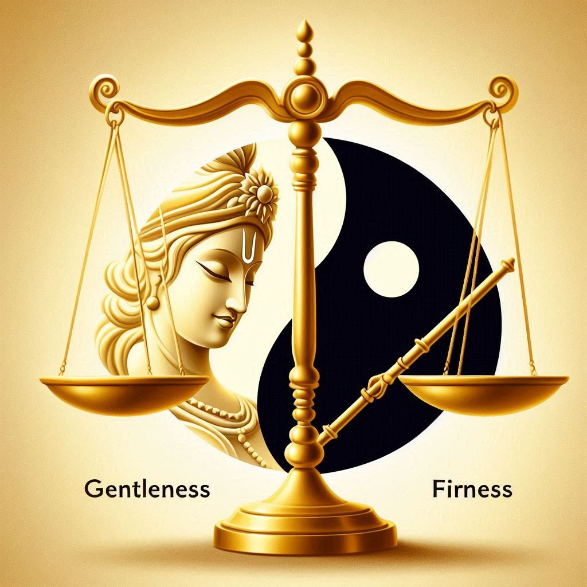

# પ્રકરણ ૧: જ્યારે પ્રેમનો અર્થ કઠોર બનવું હોય

> "કેટલીકવાર, તમે કરી શકો તે સૌથી પ્રેમાળ વસ્તુ એ છે કે કોઈને પડકારનો સામનો કરવા દો, કારણ કે તેઓ તે રીતે જ વિકાસ પામે છે." - કૃષ્ણનો એક પાઠ

## સાચો પ્રેમ શું છે? કૃષ્ણનો ઉપદેશ

આપણે ઘણીવાર પ્રેમ વિશે નરમ અને આરામદાયક વસ્તુ તરીકે વિચારીએ છીએ. આપણે માનીએ છીએ કે કોઈને પ્રેમ કરવાનો અર્થ એ છે કે તેમને હંમેશાં સારું લાગે તેવું કરવું અને તેમને મુશ્કેલીઓથી બચાવવા. પરંતુ કૃષ્ણ, હિન્દુ શાણપણમાં એક કેન્દ્રીય વ્યક્તિ, આપણને એક અલગ પ્રકારનો પ્રેમ બતાવે છે - એક એવો પ્રેમ જે કેટલીકવાર કઠોર, મક્કમ અને અન્ય લોકોને તેમના શ્રેષ્ઠ સ્વરૂપ બનવામાં મદદ કરવા પર કેન્દ્રિત હોય છે.

કલ્પના કરો કૃષ્ણની: કેટલીક વાર્તાઓમાં તેઓ વાંસળી વગાડી આનંદ અને પ્રેમ ફેલાવી રહ્યા છે. કેટલીક વાર્તાઓમાં તેઓ યુદ્ધના મેદાનમાં પોતાના મિત્ર અર્જુનને મુશ્કેલ સલાહ આપી રહ્યા છે. આ વિરોધાભાસ આપણને એક શક્તિશાળી બોધ આપે છે: **સાચો પ્રેમ ટૂંકા ગાળાની સુખદાયકતા નથી, તે લાંબા ગાળાની વૃદ્ધિ છે.**

આ પ્રકરણ કૃષ્ણના "કઠોર પ્રેમ" અને આજે આપણે મજબૂત, સ્વસ્થ સંબંધો બનાવવા માટે આ પ્રાચીન શાણપણનો ઉપયોગ કેવી રીતે કરી શકીએ છીએ તે શોધે છે.

## શા માટે કૃષ્ણનો પ્રેમ કઠણ લાગે છે

કૃષ્ણનો પ્રેમ એ એક ખાસ પ્રકારનો નિઃસ્વાર્થ પ્રેમ છે જેને પ્રેમ કહેવાય છે. આ પ્રેમ એ નથી કે તેને શું સારું લાગે છે, પરંતુ તે જે વ્યક્તિને પ્રેમ કરે છે તેના માટે શું શ્રેષ્ઠ છે તે છે. કેટલીકવાર, આપણા માટે જે શ્રેષ્ઠ છે તે સૌથી સરળ નથી હોતું.

તે ધાર્મિક સમય પણ સમજતો હતો-પાઠ માટે સંપૂર્ણ ક્ષણ જાણતો હતો. એક સારા શિક્ષકની જેમ, તે જાણતો હતો કે કોઈને શીખવામાં અને વિકાસ કરવામાં મદદ કરવા માટે ક્યારે નમ્ર બનવું અને ક્યારે મક્કમ બનવું.

### યુદ્ધક્ષેત્ર પરનો પાઠ

કુરુક્ષેત્રના યુદ્ધના મેદાનમાં અર્જુન પોતાના જ સગાંઓ સાથે લડવા જઈ રહ્યો હતો. તે દુઃખ અને શંકાથી ભરેલો હતો અને હાર માની લેવા માંગતો હતો. એક સામાન્ય મિત્ર કદાચ કહેતો કે, "કંઈ વાંધો નહીં, તારે આ કરવાની જરૂર નથી."

પણ કૃષ્ણએ એમ ન કર્યું.

તેના બદલે, તેમણે અર્જુનને કડક પ્રેમનો ડોઝ આપ્યો. તેમણે તેને કહ્યું કે પોતાની ફરજથી દૂર રહેવું એ નબળાઈની નિશાની છે અને સાચી તાકાતનો અર્થ એ છે કે જે યોગ્ય છે તે કરવું, ભલે તે મુશ્કેલ હોય. ભગવદ્ ગીતા તરીકે ઓળખાતી આ વાતચીત ક્રૂર બનવા માટે નહોતી. તેનો હેતુ અર્જુનને હિંમત અને હેતુ શોધવામાં મદદ કરવાનો હતો.

**પાઠ:** પ્રેમનો અર્થ ક્યારેક લોકોને તેમની નબળાઈની ક્ષણોમાં આશ્વાસન આપવાને બદલે, તેમના શ્રેષ્ઠ સ્વરૂપ બનવા માટે પડકાર આપવાનો થાય છે.

### રાજદરબારમાં પાઠ

બીજી એક શક્તિશાળી વાર્તા દ્રૌપદીની છે. તેણીને જાહેરમાં અપમાનિત કરવામાં આવી રહી હતી, અને તેણીએ મદદ માટે કૃષ્ણને પ્રાર્થના કરી. પરંતુ કૃષ્ણ તરત જ આગળ આવ્યા નહીં. તેમણે તેણીને બચાવતા પહેલા પરિસ્થિતિ સૌથી ખરાબ થાય ત્યાં સુધી રાહ જોઈ.

તેણે રાહ કેમ જોઈ?

૧. સત્ય બધાને બતાવવા માટે : તેના વિલંબથી ખબર પડી કે ગુનેગારો કેટલા ખોટા હતા.
૨. **તેને વધુ મજબૂત બનાવવા માટે:** દ્રૌપદીની આતુર પ્રાર્થનાએ તેની શ્રદ્ધાને વધુ ગાઢ બનાવી અને તેને વધુ મજબૂત બનાવી.
3.  **શાશ્વત પાઠ શીખવવા માટે:** વાર્તા આપણને શીખવે છે કે જ્યારે આપણે ખરેખર તેના માટે તૈયાર હોઈએ છીએ ત્યારે ઘણીવાર મદદ મળે છે, અને મુશ્કેલીઓનો સામનો કરવાથી દૈવી સાથેનું આપણું જોડાણ વધુ ગાઢ બની શકે છે.

**પાઠ:** કેટલીકવાર, સૌથી પ્રેમાળ વસ્તુ એ છે કે લોકોને પરિસ્થિતિના પરિણામોનો સામનો કરવા દેવો, જેથી તેઓ તેમાંથી શીખી શકે અને વિકાસ કરી શકે.

## "ટફ લવ" નો ખરેખર અર્થ શું છે

કૃષ્ણનું ઉદાહરણ આપણને શીખવે છે કે કઠોર પ્રેમનો અર્થ એ નથી કે તમે ખરાબ અથવા કઠોર બનો. તે કોઈની આત્માની એટલી કાળજી લેવા વિશે છે કે તમે તેમના પોતાના ભલા માટે તેમને અસ્વસ્થ કરવા તૈયાર છો.

સારો "ટફ લવ" છે:
*   **પ્રેમના સ્થળેથી કરાયેલું**, કોઈને વધવામાં મદદ કરવા માટે.
*   **લાંબા ગાળા પર ધ્યાન કેન્દ્રિત કરવું**, માત્ર હવે વસ્તુઓ સરળ બનાવવા પર નહીં.
*   **દયાળુતાથી સંતુલિત** અને સહાય.

**ફક્ત કઠોર બનવું એ છે:**
*   નિરાશા અથવા નિયંત્રણની જરૂરિયાતમાંથી કરવામાં આવે છે.
*   **સાચું હોવા પર ધ્યાન કેન્દ્રિત કરવું**, મદદ કરવા પર નહીં.
*   **કરુણા અને સમજણનો અભાવ**

## આ જ્ઞાનનો તમારા જીવનમાં ઉપયોગ કેવી રીતે કરવો?

### તમારા કુટુંબમાં
તમારા બાળકોની બધી સમસ્યાઓ ઉકેલવાને બદલે, તેમને તે કેવી રીતે ઉકેલવી તે શીખવો. તેમને નાના, કુદરતી પરિણામોનો સામનો કરવા દો. આ સ્થિતિસ્થાપકતા અને આત્મવિશ્વાસ બનાવે છે.

### મિત્રો સાથે
જો કોઈ મિત્ર ખોટા નિર્ણયો લઈ રહ્યો હોય, તો સાચો પ્રેમ માત્ર હામાં હા મિલાવવામાં નથી. પ્રમાણિક અને સંભાળ રાખતી વાતચીત કરવાની હિંમત રાખવી એ જ સાચો પ્રેમ છે, ભલે તે અસ્વસ્થ હોય તો પણ.

### કામ પર
એક સારો નેતા તેમની ટીમને વિકાસ કરવા માટે પડકારે છે. તેઓ ટીકા કરવા માટે નહીં, પરંતુ લોકોને સુધારવામાં અને તેમની સંપૂર્ણ ક્ષમતા સુધી પહોંચવામાં મદદ કરવા માટે પ્રમાણિક પ્રતિસાદ આપે છે.

## યોગ્ય સંતુલન શોધવું

અલબત્ત, પ્રેમ હંમેશાં મુશ્કેલ નથી હોતો. શાણપણ એ છે કે ક્યારે મક્કમ રહેવું અને ક્યારે નમ્ર રહેવું.

જ્યારે કોઈ વ્યક્તિ:
*   તેમનો શ્રેષ્ઠ પ્રયાસ કરી રહ્યા છે પરંતુ સંઘર્ષ કરી રહ્યા છે.
* શોક અથવા મોટી કટોકટીનો સામનો કરવો.
* પહેલેથી જ પોતાની જાત પર કઠોર બની રહ્યા છે.

જ્યારે કોઈ વ્યક્તિ:
*   તેમના કાર્યોની જવાબદારી ટાળવી.
*   વિનાશક પેટર્નમાં અટવાયેલા.
* વધુ સક્ષમ પરંતુ આરામદાયક રહેવાનું પસંદ કરે છે.

## ધ્યેય: એવો પ્રેમ જે લોકોને મુક્ત કરે

કૃષ્ણના પ્રેમનો ઉદ્દેશ લોકોને તેમના પર નિર્ભર બનાવવાનો નથી. પરંતુ તેમને મજબૂત, સમજદાર અને મુક્ત બનવામાં મદદ કરવાનો છે.

જ્યારે આપણે આ રીતે પ્રેમ કરીએ છીએ, ત્યારે આપણે આપણા જીવનમાં લોકોને વધુ સક્ષમ બનવામાં મદદ કરીએ છીએ. આપણે ફક્ત તેમના બચાવકર્તા નથી; આપણે વિકાસની યાત્રામાં તેમના સમર્થકો છીએ.

## નિષ્કર્ષ : સાચો પ્રેમ જે મદદ કરે છે

કૃષ્ણ આપણને શીખવે છે કે સાચો પ્રેમ એ અન્ય લોકોને વિકાસ કરવામાં મદદ કરવા વિશે છે, અને કેટલીકવાર વિકાસ માટે પડકારોનો સામનો કરવો પડે છે. તે પીડાને ટાળવા વિશે નથી, પરંતુ તેમાં અર્થ શોધવા વિશે છે.

આ પ્રકારના પ્રેમમાં હિંમત, સમજદારી અને ઊંડી લાગણીની જરૂર પડે છે. આ એવો પ્રેમ છે જે ફક્ત આરામ જ નથી આપતો—પરિવર્તન પણ લાવે છે. જ્યારે આપણે આ રીતે પ્રેમ કરતા શીખીએ છીએ, ત્યારે આપણે માત્ર બીજાને જ મદદ નથી કરતા, પરંતુ આપણે પોતે પણ સારા માણસ બનીએ છીએ.

---

## વિચારવા જેવા પ્રશ્નો

1.  શું એવો કોઈ સંબંધ છે જ્યાં તમે થોડા વધુ મક્કમ બનીને વધુ પ્રેમાળ બની શકો?
2. કોઈ એવો સમય યાદ કરો જ્યારે કોઈ તમારા પર કઠોર હતું અને તેનાથી તમને વિકાસ કરવામાં મદદ મળી. તમે શું શીખ્યા?
3. તમે જે લોકોની કાળજી લો છો તેમની સાથે પ્રમાણિક વાતચીત કરવાથી તમને કયા ડર રોકે છે?
4. તમારા પોતાના જીવનમાં, તમે કયા પડકારને ટાળી રહ્યા છો જેનો તમારે સામનો કરવાની જરૂર છે?

