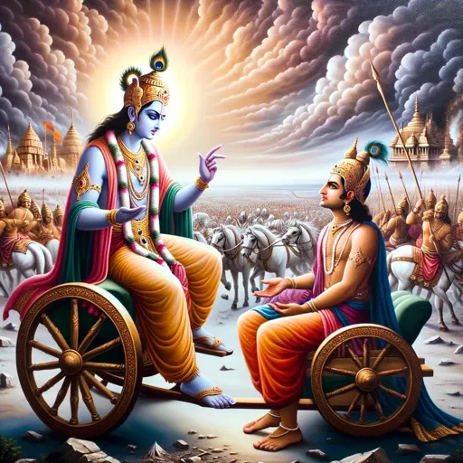

# Chapter 1: When Love Means Being Tough

> "Sometimes, the most loving thing you can do is let someone face a challenge, because that's how they grow." - A lesson from Krishna

## What is Real Love? A Lesson from Krishna

We often think of love as something soft and comforting. We believe that loving someone means always making them feel good and protecting them from hardship. But Krishna, a central figure in Hindu wisdom, shows us a different kind of love—one that is sometimes tough, firm, and focused on helping others become their best selves.

Imagine Krishna: in some stories, he is playing a flute, spreading joy and love. In other stories, he is on a battlefield, giving difficult advice to his friend Arjuna. This contrast teaches us a powerful lesson: **real love isn't about short-term comfort, it's about long-term growth.**

This chapter explores Krishna's "tough love" and how we can use this ancient wisdom to build stronger, healthier relationships today.

## Why Krishna's Love Can Seem Tough

Krishna's love is a special, selfless kind of love known as *prema*. This love is not about what makes *him* feel good, but about what is truly best for the person he loves. Sometimes, what's best for us isn't what's easiest.

He also understood *dharmic timing*—knowing the perfect moment for a lesson. Like a good teacher, he knew when to be gentle and when to be firm to help someone learn and grow.

### The Lesson on the Battlefield

On the battlefield of Kurukshetra, Arjuna was about to fight his own relatives. He was filled with sadness and doubt and wanted to give up. A typical friend might have said, "It's okay, you don't have to do this."

But Krishna didn't.

Instead, he gave Arjuna a dose of tough love. He told him that avoiding his duty was a sign of weakness and that true strength meant doing what was right, even when it was hard. This conversation, known as the Bhagavad Gita, wasn't meant to be cruel. It was meant to help Arjuna find his courage and purpose.

**The lesson:** Love sometimes means challenging people to be their best selves, not just comforting them in their moments of weakness.

### The Lesson in the Royal Court

Another powerful story is about Draupadi. She was being publicly humiliated, and she prayed to Krishna for help. But Krishna didn't step in right away. He waited until the situation was at its worst before he saved her.

Why did he wait?

1.  **To show everyone the truth:** His delay revealed how wrong the wrongdoers truly were.
2.  **To make her stronger:** Draupadi's desperate prayer deepened her faith and made her stronger.
3.  **To teach a timeless lesson:** The story teaches us that help often comes when we are truly ready for it, and that facing hardship can deepen our connection to the divine.

**The lesson:** Sometimes, the most loving thing to do is to let people face the consequences of a situation, so they can learn and grow from it.

## What "Tough Love" Really Means

Krishna's example teaches us that tough love is not about being mean or harsh. It's about caring so much for someone's soul that you are willing to make them uncomfortable for their own good.

**Good "Tough Love" Is:**
*   **Done from a place of love,** to help someone grow.
*   **Focused on the long term,** not just making things easy now.
*   **Balanced with kindness** and support.

**Just Being Harsh Is:**
*   **Done from frustration** or a need to control.
*   **Focused on being right,** not on helping.
*   **Lacks compassion** and understanding.

## How to Use This Wisdom in Your Life

### In Your Family
Instead of solving all your children's problems, teach them how to solve them. Let them face small, natural consequences. This builds resilience and confidence.

### With Your Friends
If a friend is making unhealthy choices, real love isn't just nodding along. It's having the courage to have an honest, caring conversation, even if it's uncomfortable.

### At Work
A good leader challenges their team to grow. They give honest feedback not to criticize, but to help people improve and reach their full potential.

## Finding the Right Balance

Of course, love isn't always tough. Wisdom is knowing when to be firm and when to be gentle.

**Be gentle when someone is:**
*   Trying their best but struggling.
*   Dealing with grief or a major crisis.
*   Already being hard on themselves.

**Be firm when someone is:**
*   Avoiding responsibility for their actions.
*   Stuck in a destructive pattern.
*   Capable of more but choosing to stay comfortable.

## The Goal: Love That Sets People Free

The goal of Krishna's love is not to make people dependent on him. It is to help them become strong, wise, and free.

When we love this way, we help the people in our lives become more capable. We are not just their rescuers; we are their supporters on the journey of growth.

## Conclusion: The Love That Truly Helps

Krishna teaches us that true love is about helping others grow, and sometimes growth requires facing challenges. It's not about avoiding pain, but about finding meaning in it.

This kind of love requires courage, wisdom, and a deep sense of caring. It's a love that doesn't just comfort—it transforms. When we learn to love this way, we not only help others, but we also become better people ourselves.

---

## Questions to Think About

1.  **Is there a relationship where you could be more loving by being a little firmer?**
2.  **Think of a time someone was tough on you, and it helped you grow. What did you learn?**
3.  **What fears stop you from having honest conversations with people you care about?**
4.  **In your own life, what challenge are you avoiding that you know you need to face?**

